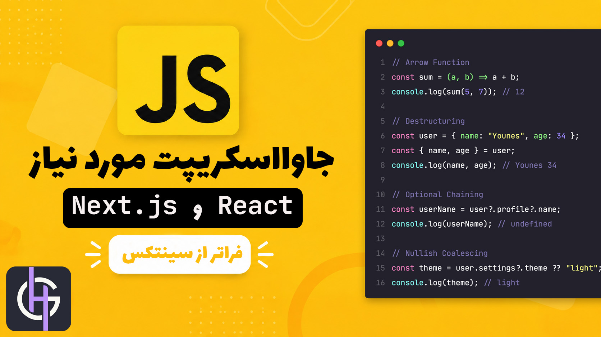

# 🚀 جاوااسکریپت مورد نیاز React و Next.js: فراتر از سرفصل‌ها و سینتکس

سلام بر دوستان و یاران جان 👋  
به انباره دوره «جاوااسکریپت مورد نیاز React و Next.js : فراتر از سینتکس 🚀 » خوش اومدی.

تمام فایل‌ها، مثال‌ها و تمرین‌ها در همین شاخه اصلی (`main`) قرار دارن تا به راحت‌ترین شکل ممکن بهشون دسترسی داشته باشی و درگیر پیچیدگی‌های گیت و گیتهاب نشی.

---

## 📁 ساختار پوشه‌بندی مخزن

پروژه به بخش‌های مشخصی تقسیم شده که از مفاهیم پایه تا الگوهای پیشرفته در ری‌اکت رو پوشش میده:

- **01-fundamentals/**: مفاهیم پایه، Scope و Hoisting
- **02-functions/**: انواع توابع و Arrow Functions
- **03-arrays-objects/**: متدهای آرایه و کار با آبجکت‌ها
- **04-destructuring-ops/**: تخریب ساختار، Spread و Rest
- **05-async-javascript/**: پرامیس‌ها و Async/Await
- **06-react-patterns/**: الگوهای پرکاربرد JS در ری‌اکت
- **و فصل‌های دیگه**

---

## 🛠️ چطور از کدها و تمرین‌ها استفاده کنی؟

خیلی ساده این مراحل رو دنبال کن:

1. **کلون کردن مخزن روی سیستم خودت:**  
   `git clone https://github.com/younes-ghorbany/js-beyond-syntax`
2. **ورود به پوشه پروژه:**  
   `cd js-beyond-syntax`
3. **اجرای کدها با Node.js:**  
   مثلاً برای اجرای فایل‌های هر بخش کافیه ترمینال رو باز کنی و بزنی:

`node 03-arrays-objects/immutability.js`

---

## 🤝 مرام‌نامه یادگیری دوره

- **تحلیل به جای کپی:** اول خودت تلاش کن کدهای تمرین رو بنویسی. کپی کردن کدهای آماده، ماهیچه‌های حل مسئله‌ات رو قوی نمی‌کنه 😉
- **خرابکاری کن:** کدها رو تغییر بده، خروجی‌ها رو دستکاری کن و نترس از اینکه ارور بگیری. یادگیری واقعی همونجا اتفاق میافته.

این خیلی خوبه که برای ارتقای مهارت‌هات وقت میذاری. توی این مسیر هر جا به چالش خوردی، من کنارتم. کافیه از بخش تیکت‌های سایت باهام در تماس باشی 👍️
